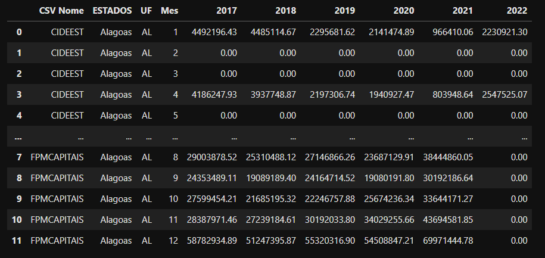

# Desafio para o processo seletivo

## Desafio:

Seu desafio será obter informações sobre o valor das transferências obrigatórias da União para os estados entre os anos de 2017 e 2022 APENAS para o estado de Alagoas. 

Este é um desafio <b>NÃO ELIMINATÓRIO</b>. Isto quer dizer que vamos utilizar este teste apenas para entender melhor o seu perfil, sua lógica de programação e assim, poderemos traçar o melhor plano de treinamento caso você seja selecionado(a).

## Onde encontrar informações sobre servidores ativos: 

O Tesouro Nacional disponibiliza vários conjuntos de dados na seção de dados abertos. Vamos coletar TODOS os csv disponibilizados na seguinte página: https://www.tesourotransparente.gov.br/ckan/dataset/transferencias-obrigatorias-da-uniao. Isto é, coletaremos informações sobre as seguintes traferências da união para os Estados: 'CIDE_EST', 'CIDE_MUN', 'FEX_EST', 'FEX_MUN', 'FPE', 'FPM', 'IOF_EST', 'IOF_MUN', 'IPI EXP', 'ITR', 'LC87_EST', 'LC87_MUN', 'LC176_EST',
'LC176_MUN', 'TCP' e 'FPM_CAPITAIS'.

## Instruções:

O seu processo de ETL poderá ser dividido nas seguintes etapas:
 <li>
 Extração de dados:
 <ol>
 Extraia TODOS os CSV da url fornecida acima 
 Fique a vontade para extrair os dados usando a ferramenta na qual você se sente confortável (scrapy, bs4 etc) 
 </ol>
 <li>
 Transformação dos dados:
 <ol>
 Queremos APENAS dados de 2017 a 2022 
 Apenas dados do Estado de Alagoas 
 Os meses devem ser do tipo Inteiros 
 Os valores monetários devem ser do tipo Float 
 Unir todas as tabelas em uma única tabela com todas as transferências. 
 </ol>
 </li>
 
O resultado final deve ser um dataframe com as seguintes informações e na seguinte ordem das colunas: 
 

 
## Atenção:

<ul>
    <li>Nós trabalhamos com Python 3.</li>
    <li>Sugerimos o uso de repositórios públicos (como GitHub ou GitLab) e o envio da URL do repositório com o código criado em Python, mas você também podem zipar o código e enviar por email; se você optar por outras ferramentas (Google Colab, Gitpod, PythonAnywhere), é necessário que o código da solução seja compartilhada através de um link público.</li>
    <li>Não responder o teste completamente não te desclassifica do processo seletivo. Mas, tente obter o máximo possível de informações. </li>
    
</ul>

NÃO EXISTE resposta certa

